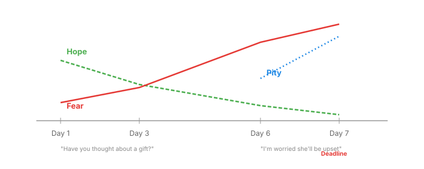
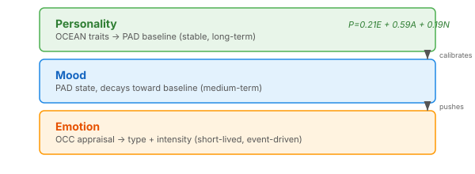
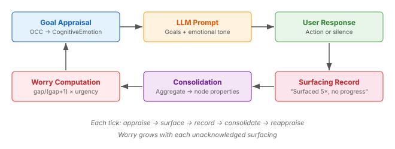

# Your Agent Doesn't Know How It Feels

Most agent systems treat emotion as a rendering problem. Slap a sentiment label on the output, adjust the tone, move on. The LLM handles the rest.

This is backwards. Emotion is a *computation* problem — and the field solved it decades before anyone was prompting language models.

## The Missing Layer

An agent that tracks your goals, monitors your deadlines, and reminds you about your daughter's birthday needs more than text generation. It needs to *appraise* the situation — to evaluate what's happening against what matters, compute an emotional response, and track that response over time.

Consider what "worry" actually requires:

<p align="center"></p>

Day 1: gentle reminder, mostly hopeful. Day 3: concern building, hope fading. Day 6: genuine worry — and now empathic concern for the daughter. Day 7: "Mark, I told you last week. I've reminded you every day. I imagine your daughter will be really upset."

That progression isn't tone adjustment. It's a computation: urgency rising, surfacing count incrementing, no progress detected, relationship scores amplifying empathic concern. Each emotion has a type, an intensity, a subject, and a source — intrinsic worry about the agent's own goal to help, empathic pity arising from modelling how the daughter will feel.

## OCC: The 40-Year-Old Answer

Ortony, Clore, and Collins published *The Cognitive Structure of Emotions* in 1988. They defined 22 emotion types as products of cognitive *appraisal* — evaluating events against goals, actions against standards, objects against attitudes. The model was explicitly designed to be computationally tractable.

The 22 types organise into three branches:

| Branch | You're appraising | Valence | Key types |
|--------|------------------|---------|-----------|
| **Events** | consequences for goals | Pleased / Displeased | Hope, Fear, Joy, Distress, Satisfaction, Disappointment, Relief |
| **Agents** | actions by standards | Approving / Disapproving | Pride, Shame, Admiration, Reproach |
| **Objects** | aspects by attitudes | Liking / Disliking | Love, Hate |

The prospect-based emotions — Hope, Fear, Satisfaction, Disappointment, Relief, Fears-confirmed — map directly to a goal lifecycle. A goal starts with Hope. As urgency rises without progress, Fear grows. When the outcome resolves: Satisfaction if it succeeds, Fears-confirmed if it fails, Relief if a feared outcome is narrowly avoided.

This is the birthday scenario. The OCC model doesn't just label the emotions — it specifies the *appraisal variables* that determine intensity: desirability (how much the goal matters), likelihood (how probable the outcome), proximity (how close the deadline), and effort invested (how many times you've tried).

## From Categories to Coordinates

OCC gives you emotion types. But agents also need a continuous emotional space — for mood tracking, personality baselines, and decay dynamics.

Gebhard's ALMA model (2005) bridges this gap with a three-layer architecture:

<p align="center"></p>

**Layer 1 (Emotion):** OCC appraisal fires, producing a typed emotion with intensity. Fear about the birthday at intensity 0.8. Short-lived — decays within a tick cycle unless re-triggered.

**Layer 2 (Mood):** Emotions push the PAD mood state (Pleasure-Arousal-Dominance). Repeated Fear pushes mood into the Anxious octant. Mood decays exponentially toward the personality baseline.

**Layer 3 (Personality):** Stable traits determine the baseline and calibration. An anxious personality (high arousal baseline) triggers Fear at lower thresholds. ALMA maps Big Five traits to PAD coordinates via Mehrabian's 1996 regression equations.

Each OCC type maps to specific PAD coordinates. Fear is P:-0.64, A:+0.60, D:-0.43 (unpleasant, high-energy, low-control). Hope is P:+0.20, A:+0.20, D:-0.10 (mildly pleasant, alert, slightly submissive). These values come from Gebhard's empirical mapping, validated across agent implementations.

## Two Emotional Systems, Not One

Here's where most agent architectures stop: they compute the agent's emotions about its goals. But there are actually two distinct systems:

**System A — Understanding the user.** The agent models how other people feel. "Mark is probably anxious." This is Theory of Mind — OCC applied to predict *their* emotional states. It uses MentalModel and UserModel components.

**System B — The agent's own emotions.** The agent's cognitive-emotional model, applied to its own goals. "I feel Fear that the birthday will be missed." This includes *empathic* emotions that arise from understanding others — the agent can only feel Pity for the daughter if it has first modelled her likely emotional state via System A.

```
System A: model the daughter → "she expects a gift, won't get one"
              → predict: she'll feel Disappointment
                  ↓
System B: appraise against fortunes-of-others
          → "undesirable event for liked other" → Pity(daughter, 0.6)
```

The Pity is the agent's own emotion — an empathic response to its model of someone else's state. It's not the same as detecting the daughter's sadness. It's the agent *feeling something* because it understands what will happen.

## Recording vs Experiencing

This distinction matters for memory. Today, most agent memory systems are stenographers — recording what the user said, what happened, what was decided. The agent's memory is the user's life story.

But when the agent feels Fear(0.8) for a week, then Relief(0.9) when the gift is finally bought — that Fear→Relief arc is the *agent's own experience*. It should be stored as such:

> "The week before the birthday was stressful. I reminded Mark seven times. Each day my worry grew. When he finally ordered the gift, I felt enormous relief."

That's not a recording of the user's experience. It's the agent's autobiographical memory — domain="agent-experience" rather than domain="experience". A cognitive agent that can recall its own emotional history relates to users differently than one that merely indexes their data.

## Surfacing Tracking: Closing the Loop

The mechanism that drives the Day 1→7 progression is *surfacing tracking*. When the agent renders a goal into the LLM's prompt, it records that act as an event. Neocortex's consolidation pipeline aggregates these into node properties: surfaced-count, first-surfaced-at, last-surfaced-at, last-progress-at.

<p align="center"></p>

The surfacing-progress gap — surfacings since the last progress event — drives the worry computation. The formula `gap / (gap + 1)` saturates: early surfacings cause rapid worry increase, later ones add diminishing increments. Combined with dynamic urgency from the deadline, this produces natural emotional escalation without hand-tuned thresholds.

When the user finally acts — buys the gift, records progress — the gap resets. Fear drops. If the action came at the last moment: Relief. If it came comfortably early: Satisfaction. If the deadline passes without action: Fears-confirmed plus Pity for the daughter. The OCC taxonomy handles all these transitions with formal specificity.

## What the Research Already Solved

The datasets exist for calibration: ISEAR (7,666 situation descriptions with appraisal data across 37 countries), GoEmotions (58k fine-grained emotion labels), EmoBank (10k VAD-annotated sentences). The architectures exist: ALMA, WASABI, FAtiMA. The mappings exist: OCC→PAD (Gebhard 2005), OCEAN→PAD (Mehrabian 1996). The formalisations exist: Steunebrink's 2009 revision with complete type specifications.

None of this is new. What's new is the application context: agents that persist, that track goals over days, that accumulate emotional state across interactions, that can remember how *they* felt — not just what they were told.

The implementation is open-ended, but the science is settled. Agents that compute emotion through formal appraisal rather than prompt engineering will produce more consistent, more calibrated, and more genuinely responsive behaviour. The OCC model is thirty-eight years old and still the most implemented framework in affective computing. Sometimes the answer has been waiting for the right question.
