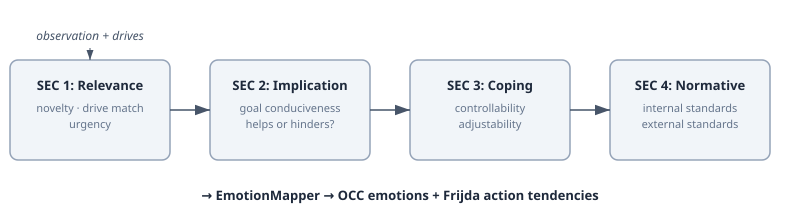

# CARMA: Giving LLM Agents an Inner Mind

Most LLM agents don't feel anything. They generate text that sounds emotional — "I'm concerned about this approach" — but there's no state behind the words. No perception of the situation. No evaluation against what the agent cares about. No readiness to act on the result. The emotion is performed, not computed.

CARMA (Cognitive-Affective Runtime for Minded Agents) is a cognitive architecture that changes this. It gives LLM agents an inner mind — with emotions, motivations, and personality-shaped responses computed before the language model ever sees the prompt.

## Cognitive Architectures — A 40-Year Lineage

The idea of giving artificial agents more than raw intelligence isn't new. Cognitive architectures have been modelling the full mind — perception, memory, attention, emotion, motivation — since the 1980s:

| Architecture | Era | What it models beyond reasoning |
|---|---|---|
| SOAR (Laird, Newell) | 1983 | Perception, learning, emotion (since 2004) |
| ACT-R (Anderson) | 1993 | Memory decay, attention, learning timing |
| CLARION (Ron Sun) | 2002 | Motivation, personality (Big Five), drives |
| LIDA (Stan Franklin) | 2007 | Attention, emotion, consciousness model |
| **CARMA** | 2026 | Appraisal-driven emotions, personality-parameterised habituation, OCC taxonomy |

CLARION is the closest ancestor — it explicitly models motivational drives and personality traits parameterising behaviour. The difference: CLARION runs on symbolic/connectionist hybrids from 2002. CARMA runs on LLM agents with Scherer appraisal theory, OCC emotions, and personality derived from Jungian disposition profiles. Same intellectual lineage, fundamentally different computational substrate.

## Why Appraisal Theory?

Appraisal theory (Lazarus, 1991; Scherer, 2001) says emotions aren't random. They're the result of evaluating a situation against your goals, your ability to cope, and your standards. Fear isn't "something bad" — it's *relevant threat* plus *low controllability*. Anger is the same threat but with *high controllability*. The difference between running and fighting is a single dimension shift.

This matters for practitioners because it gives emotions a *mechanism*. When your agent expresses fear, you can trace it back through the evaluation: which drive was threatened, how severe the implication was, whether the agent had coping resources. Instead of an LLM improvising an emotional tone, the architecture computes one from measurable dimensions.

## The SEC Pipeline

Scherer's Component Process Model defines four Stimulus Evaluation Checks — sequential assessments that every stimulus passes through. CARMA implements each as an independent, composable `SecCheck`:

**What each check computes, and why it matters:**

| SEC | Dimensions | What it answers | Practical impact |
|---|---|---|---|
| **Relevance** | novelty, drive match, urgency | Does this matter to me? | Agents ignore irrelevant stimuli instead of reacting to everything |
| **Implication** | goal conduciveness | Does this help or hinder my goals? | Positive events produce approach; negative events produce caution |
| **Coping** | controllability, adjustability | Can I handle this? | Same threat → fear (low coping) or anger (high coping) |
| **Normative** | internal/external standards | Does this violate my values? | Shame from self-failure; reproach from others' violations |

Each check is a `@FunctionalInterface` — swap in an LLM-backed implementation for any one while keeping the others computational. Toggle checks on and off via `SchererAppraisalConfig`. The experiment surface is the configuration, not the code.

## From Dimensions to Emotions

The `EmotionMapper` reads the combined SEC dimensions and applies pattern rules grounded in the OCC taxonomy (Ortony, Clore & Collins, 1988). The OCC model classifies 22 emotion types by what triggers them — goal outcomes, standard violations, or attitude objects:

| SEC Pattern | Emotion | OCC Category | Action Tendency (Frijda) |
|---|---|---|---|
| relevant + negative + low coping | **Fear** | prospect-based | Avoidance — withdraw from the threat |
| relevant + negative + high coping | **Anger** | compound | Antagonism — confront the obstacle |
| relevant + positive | **Joy** | well-being | Approach — move toward the source |
| relevant + negative (fallback) | **Distress** | well-being | — |
| internal standards violated | **Shame** | attribution | — |
| external standards violated | **Reproach** | attribution | — |

Each emotion carries a PAD projection (Pleasure-Arousal-Dominance) from Gebhard's ALMA model (2005). Fear is `P:-0.64, A:0.60, D:-0.43`. These coordinates come from empirical psychological research — they model how each emotion shifts the agent's overall mood state. A fearful agent becomes more aroused, less pleasant, and less dominant. That mood shift then colours subsequent responses until it decays.

## Personality Shapes Everything

The same observation produces different emotions in different agents — not because of random variation, but because personality parameterises the pipeline. This is where CARMA diverges from a generic emotion engine.

An agent with a bold disposition habituates faster — novelty wears off in 2-3 exposures. A conservative agent tolerates repetition for 8+ exposures before boredom kicks in. These parameters aren't hand-tuned. They're derived automatically from the agent's disposition profile through the `CognitiveDerivationEngine`:

| Disposition | Habituation Rate | Repetition Tolerance | What this means |
|---|---|---|---|
| Bold / Flexible | 0.4 | 3.0 | Bores quickly, needs novelty |
| Calculated / Moderate | 0.2 | 5.0 | Balanced engagement |
| Conservative / Strict | 0.1 | 8.0 | Comfortable with routine, slow to disengage |

`AppraisalWeights` further shapes which emotions fire first. An agent with a high-Ni Jungian profile (introverted intuition) produces lower fear-onset thresholds — it senses threats earlier. A high-Se profile (extraverted sensing) has a higher threshold — it takes more to rattle. Different personality, different emotional landscape, same pipeline.

## What This Means If You're Building Agents

**Explainability.** When an agent expresses fear, you can trace it: the observation matched drive X with relevance 0.8, the implication check scored conduciveness at -0.6, the coping check scored controllability at 0.2. Fear emerged because the pattern matched — not because the LLM improvised. For regulated industries or safety-critical applications, that trace is the difference between "the agent did something" and "here's why."

**Composability as an experimental method.** Want to know if the normative check actually adds value for your use case? Toggle it off, run the same scenarios, compare outputs. `SchererAppraisalConfig` makes each SEC an independent variable. This is how we're validating the pipeline — not by theoretical debate, but by measuring which checks produce useful signal.

**Separation of emotion from generation.** The CARMA pipeline runs before the LLM generates its response. The `AppraisalPromptSection` renders the computed state as evocative text — "You feel strong fear. You want to get away from the dark corridor." — which becomes part of the system prompt. The LLM doesn't decide how to feel. It expresses what the appraisal pipeline already computed. The emotions are deterministic and reproducible. The language is generative and natural.

Four decades of cognitive architecture research, forty years of appraisal theory, and an LLM that finally makes it practical. The interesting question now is where the computational checks fall short and an LLM needs to step in — for the same SEC, on the same scenario, does an LLM-backed check produce meaningfully better emotional responses than keyword analysis? The pipeline is designed to answer that question empirically.
